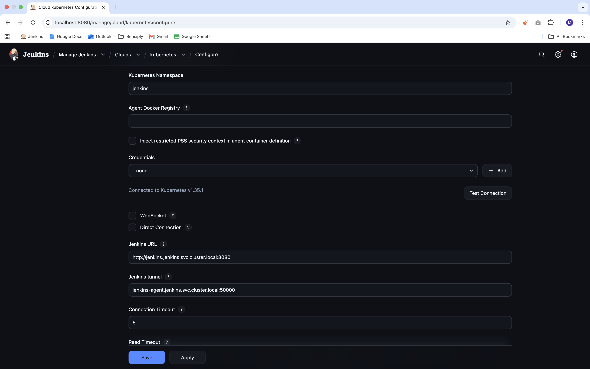

I cloned my JCasC Plugin + Manual DinD Sidecar Container Project from: 
https://github.com/Ashir-Qayyum/jenkins-jcasc-plugin-poc.git 
(The project uses shared-library functions for CI/CD pipeline)

I modified the values.yaml at jenkins-jcasc-helm/values.yaml to remove 
the sidecars section, security, and volumes section as this time I 
am no longer launching DinD Sidecar Container and share docker daemon 
for building the docker images.

Rather, I am using Jenkins Kubernetes Plugin to launch kubernetes agent pod with 
containers specific to the pipeline stages & with the required tools installed 
These ephemeral containers contain the tools required in the pipeline stage, 
They perform the task in the functions ,and get terminated with the pod once the task is completed.

In my Jenkinsfile, I have included all the kubernetes agents configurations i required for the 
pipeline including the shared volumes, and containers of DinD (contains docker daemon 
for image building, shared it to docker CLI), docker CLI (for login, build, & push the image to dockerhub),  
and Helm (for installing the sms deployment stacks) using their official public images. 
Later, in the pipeline stages, I wrapped the pipeline functions inside the containers 
required to execute the task with specified tools.

THE FLOW IS THE FOLLOWING:

The pipeline job is triggered. 
Jenkins controller will launch the ephemeral containers defined as the agents 
in the jenkins-k8s-agent-pipeline pod. 
Each stages will be executed inside the particular container it is defined in with. 
docker container with docker:29-cli image will execute the dockerhub login, image 
building and pushing job. 
During the build, the docker daemon is provided by the DinD container via shared volumes 
Once the image is built & pushed, the helm container will execute the deployment stage 
AND upgrade the helm installation of SMS App Stacks.

INSTALLATION:

First, I created the namespace for jenkins 
> kubectl create ns jenkins 

(Verfify it with: kubectl get ns) 

I installed jenkins using my custom jenkins helm chart (from inside jenkins-jcasc-helm/): 
> helm install jenkins . -f values.yaml -n jenkins 

This installed jenkins with the plugins & also JCasC Configurations 
Git, CasC, Kubernetes Agents and other plugins is installed along with the installation 
The Jenkins is Configured with the JCasC files I created at /jenkins-jcasc-helm/files/jcasc 
which most importantly configure my dockerhub credentials, shared-library source repo 
, and the kubernetes Agent (I am using Minikube. I've installed & configured jenkins, k8s agents,  
and the app deployments in the same minikube cluster)

I created the ClusterRoleBinding earlier. The CRBs does not get deleted when 
we delete even the whole namespace, therefore, i didn't applied the jenkins-admin-crb.yaml 
file again (at /jenkins-sa-config/jenkins-admin-crb.yaml) for creating the crb for jenkins service 
account. So when I installed jenkins, the jenkins service accout is created, and it bound with the 
ClusterRoleBinding I already applied. 
Therefore, it is NOT present in the terminal screenshot below. 
If I haven't created it earlier, I would have applied it with (running at /jenkins-sa-config/): 
> kubectl apply -f jenkins-admin-crb.yaml

Then I get the jenkins service name with: 
> kubectl get svc -n jenkins 

And Port-forwarded it to access the UI (As I am using Minikube with NodePort): 
(running in the background at different terminal tab)
> kubectl port-forward svc/jenkins -n jenkins 8080:8080 --address 0.0.0.0 & 

And accessed the Jenkins UI in the browser at: http://localhost:8080 

After logging in with the admin username & Password I provided in the valuesa.yaml 
I first validated all the Configuration I provided using JCasC Plugin 
including dockerhub credentials, shared-library, and kubernetes agent configuration 
Finally, tested connection with the cloud kubernetes configuration 
at http://localhost:8080/manage/cloud/kubernetes/configure

Then I create a new job for the pipeline, configure it with my GitHub repository: 
https://github.com/Ashir-Qayyum/jenkins-kubernetes-agent-poc.git 
with manual build, Job SCM with Jenkinsfile, and other configurations

FINALLY, I tested the pipeline by triggering the Build. The following flows happened 
Initially there were 2 running containers in the jenkins pod including jenkins (controller)
and config-reload. 
After triggering the pipeline, the new pod was launched jenkins-k8s-agent-pipeline 
with 4 containers inside the jenkins-k8s-agent-pipeline pod, jnlp, dind, helm, docker 
The Stages were executed inside the different containers of the agent pod as defined in the 
pipeline. Once the pipelie execution was completed, the containers and pod were terminated 

Testing kubernetes cloud configurations connection: 
 

Triggering the Build & Pipeline Status: 
.png>) 
.png>) 

Terminal Screenshot (installations, and pods/containers status) 
.png>) 

FINALLY, the SMS App Stacks was deployed using helm through 
the Pipeline including frontend, backend, and postgres 
(as can be seen in the terminal Output Above)

I get the frontend service name with: 
> kubectl get svc -n jenkins 

,And port-forwarded the frontend service to access 
the Application UI at port 8081 & tested it 
> kubectl port-forward svc/frontend -n jenkins 8081:80 --address 0.0.0.0 &

Port-forwarding:
.png>)

SMS Frontend:
.png>)